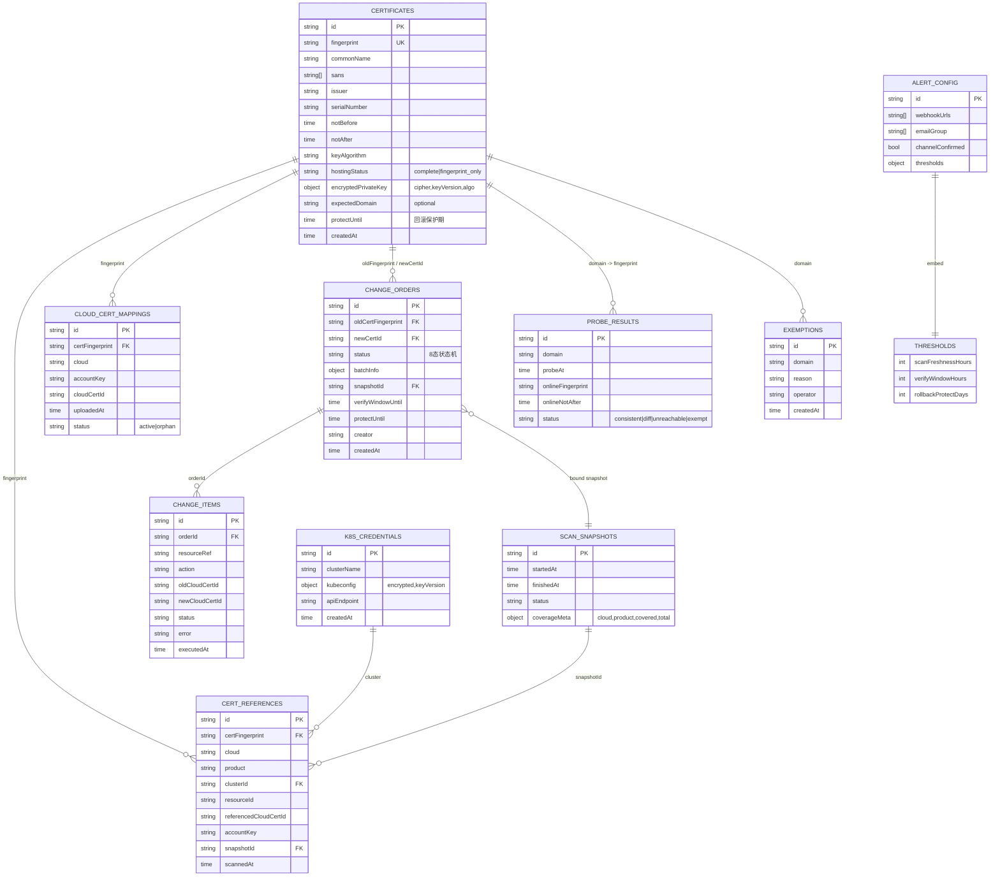

# ER Diagram: SSL 证书管理功能域

## 索引策略

| 集合 | 索引 | 用途 |
|------|------|------|
| cert_certificates | fingerprint (unique) | 去重/聚合键 |
| cert_certificates | hostingStatus | 台账统计 |
| cert_references | certFingerprint + cloud + product | 引用查询 |
| cert_references | snapshotId | 按快照清理 |
| cert_change_orders | oldCertFingerprint + status | 在途互斥查询 |
| cert_change_items | orderId | 变更单明细 |
| cert_cloud_cert_mappings | certFingerprint + cloud + accountKey (unique) | 两段式去重 |
| cert_probe_results | domain + probeAt (desc) | 最近探测查询 |
