# ER Diagram: SSL 证书管理功能域

```mermaid
erDiagram
    CERTIFICATES ||--o{ CERT_REFERENCES : "fingerprint"
    CERTIFICATES ||--o{ CLOUD_CERT_MAPPINGS : "fingerprint"
    CERTIFICATES ||--o{ CHANGE_ORDERS : "oldFingerprint / newCertId"
    CERTIFICATES ||--o{ PROBE_RESULTS : "domain -> fingerprint"
    SCAN_SNAPSHOTS ||--o{ CERT_REFERENCES : "snapshotId"
    CHANGE_ORDERS ||--o{ CHANGE_ITEMS : "orderId"
    CHANGE_ORDERS }o--|| SCAN_SNAPSHOTS : "bound snapshot"
    CERTIFICATES ||--o{ EXEMPTIONS : "domain"
    K8S_CREDENTIALS ||--o{ CERT_REFERENCES : "cluster"
    K8S_CREDENTIALS ||--o{ CRD_REGISTRATIONS : "clusterId"
    ALERT_CONFIG ||--|| THRESHOLDS : "embed"

    CERTIFICATES {
        string id PK
        string fingerprint UK
        string commonName
        string[] sans
        string issuer
        string serialNumber
        time notBefore
        time notAfter
        string keyAlgorithm
        string hostingStatus "complete|fingerprint_only"
        object encryptedPrivateKey "cipher,keyVersion,algo"
        string expectedDomain "optional"
        time protectUntil "回滚保护期"
        string expiryAlertLevel "none|L30|L14|L7|expired 到期告警去重状态"
        time createdAt
    }

    CERT_REFERENCES {
        string id PK
        string certFingerprint FK
        string cloud
        string product
        string clusterId FK
        string resourceId
        string referencedCloudCertId
        string accountKey
        string snapshotId FK
        time scannedAt
    }

    SCAN_SNAPSHOTS {
        string id PK
        time startedAt
        time finishedAt
        string status "running|done|failed; running超scanTimeoutHours(默认2h)由scan-timeout任务转failed释放防重"
        string failReason "failed原因码,含SCAN_TIMED_OUT"
        object coverageMeta "cloud,product,covered,total(-1=分母不可用)"
    }

    CHANGE_ORDERS {
        string id PK
        string oldCertFingerprint FK
        string newCertId FK
        string status "9态状态机,含 cancelled 取消终态"
        object batchInfo "totalBatches,currentBatch,batchSize,paused,pausedAt"
        string snapshotId FK
        time verifyWindowUntil
        time protectUntil
        string activeMutex "在途互斥token,活跃态=oldCertFingerprint,终态清除"
        object verifyExpected "newCertFingerprint,domains[],excludedDomains[],windowUntil 预期终态快照(豁免域名剔除)"
        string creator
        time createdAt
    }

    CHANGE_ITEMS {
        string id PK
        string orderId FK
        int batchNo "批次归属,Confirm时固化,执行取batchNo=currentBatch"
        string action "upload_and_bind|patch_crd"
        object resourceRef "持久化完整DeployTarget,按action分支必填: cloud_api={channel,cloud,product,accountKey,resourceId}; k8s_api={channel,clusterId,namespace,kind,resourceId}"
        string oldCloudCertId
        string newCloudCertId
        string status
        string error
        time heartbeatAt "执行心跳(30s间隔更新),executing-timeout判据:默认30分钟超时标failed+告警"
        time executedAt
    }

    CLOUD_CERT_MAPPINGS {
        string id PK
        string certFingerprint FK
        string cloud
        string accountKey
        string cloudCertId
        time uploadedAt
        string status "active|orphan"
    }

    PROBE_RESULTS {
        string id PK
        string domain
        time probeAt
        string onlineFingerprint
        time onlineNotAfter
        string status "consistent|diff|change_linked_diff|unreachable|exempt|wildcard_skipped(通配符SAN默认跳过拨测)"
        string changeOrderId "change_linked_diff时关联变更单"
    }

    EXEMPTIONS {
        string id PK
        string domain
        string reason
        string operator
        time createdAt
    }

    ALERT_CONFIG {
        string id PK
        string[] webhookUrls
        string[] emailGroup
        bool channelConfirmed
        object verifyWindowRoute "enabled,webhookUrls[],emailGroup[] 验证窗口路由"
        object wildcardProbeOverrides "通配符SAN->具体探测子域名(concreteSubdomainOverride)"
        object thresholds
    }

    K8S_CREDENTIALS {
        string id PK
        string clusterName
        object kubeconfig "encrypted,keyVersion"
        string apiEndpoint
        time createdAt
    }

    CERT_BATCH_SESSIONS {
        string batchId PK
        object[] files "fileName,certId,result,errorReason"
        string status "running|completed|partial_failed"
        object progress "total,done,failed"
        string operator
        time createdAt
        time finishedAt
    }

    CRD_REGISTRATIONS {
        string id PK
        string clusterId UK
        string apiGroup UK
        string kind UK
        string certFieldPath "云托管证书引用字段路径"
        bool enabled
        string operator
        time createdAt
    }

    THRESHOLDS {
        int scanFreshnessHours "1~72,默认24"
        int verifyWindowHours "2~24,默认24"
        int rollbackProtectDays "7~14,默认7,恒>verifyWindowHours"
        int verifyConfirmProbes "窗口达标连续一致次数,默认2"
        int verifyProbeIntervalMinutes "窗口内提频探测周期,默认10"
        int pauseTimeoutHours "批间暂停超时自动取消,默认72"
        int recheckDelayMinutes "K8s patch后CRD复检延迟(分钟),默认5"
        int itemHeartbeatTimeoutMinutes "执行项心跳超时(分钟),默认30,超时标failed+告警并重算单据状态"
        int scanTimeoutHours "扫描running超时(小时)转failed释放防重,默认2"
        int[] expiryLevels "到期分级天数,默认[30,14,7]"
    }
```

## 索引策略

| 集合 | 索引 | 用途 |
|------|------|------|
| cert_certificates | fingerprint (unique) | 去重/聚合键 |
| cert_certificates | hostingStatus | 台账统计 |
| cert_certificates | notAfter | 到期分级扫描 |
| cert_references | certFingerprint + cloud + product | 引用查询 |
| cert_references | snapshotId | 按快照清理 |
| cert_change_orders | activeMutex (unique, partial: activeMutex 存在) | 在途互斥强制：同一 oldCertFingerprint 同时仅一张活跃单，duplicate key → CHANGE_IN_FLIGHT（关闭 check-then-insert 竞态） |
| cert_change_orders | oldCertFingerprint + status | 历史单查询（终态） |
| cert_change_items | orderId | 变更单明细 |
| cert_change_items | orderId + status | 批次进度统计 |
| cert_change_items | orderId + batchNo | 当前批执行取项与批次归属查询 |
| cert_change_items | status + heartbeatAt (partial: status=running) | executing-timeout 超时扫描（executing 态活性保障） |
| cert_batch_sessions | createdAt (TTL 30d) | 会话过期自动清理 |
| cert_crd_registrations | clusterId + apiGroup + kind (unique) | 登记去重 |
| cert_cloud_cert_mappings | certFingerprint + cloud + accountKey (unique) | 两段式去重 |
| cert_probe_results | domain + probeAt (desc) | 最近探测查询 |
| cert_probe_results | probeAt (TTL 90d) | 过期探测结果自动清理 |

可执行定义（createCollection + createIndex + 校验器）见 schema.sql。

## 语义说明

- **引用三态**：`has_refs`（有引用）/ `no_refs_scanned`（未发现引用=已扫描无匹配，可能漏报）/ `blind_spot`（盲区=未纳入扫描或扫描失败）。由 ScanSnapshot × CertReference 派生，DTO 派生量非存储字段；has_refs 与 blind_spot 删除均拦截 CERT_HAS_REFS，语义详见 tech-design.md"引用状态语义"
- **覆盖率分母**：coverageMeta[].total 来源 `internal/asset` 资产同步盘点（独立于引用扫描通道），扫描任务启动时按云×产品聚合固化入快照；total=-1 表示分母不可用（盲区声明）
- **在途互斥**：由 activeMutex 部分唯一索引在 DB 层强制，应用层检查仅作快速失败；状态机终态迁移与 token 清除同原子 update 完成
- **验证窗口告警路由**：ProbeResult.status 含 `change_linked_diff`（窗口内 domain ∈ verifyExpected.domains 且线上指纹=新指纹）；AlertConfig.verifyWindowRoute 控制窗口内告警走变更关联通道，窗口关闭恢复常规通道
- **验证窗口时间维度**：窗口内该批域名探测周期提至 thresholds.verifyProbeIntervalMinutes（默认 10 分钟，天级巡检节奏下短窗口采样不足）；窗口到期由 scheduler 定时任务扫描 verifyWindowUntil 到期单据做终局判定（不依赖被动探测）
- **豁免 ∩ 验证窗口**：verifyExpected.domains 构建时剔除豁免域名并记入 excludedDomains，豁免域名验证项计 skipped、不参与达标判定，避免窗口永不达标死锁
- **取消终态（cancelled）**：draft/pending_confirm 可人工取消；批间暂停分批单可人工取消，或 pausedAt + pauseTimeoutHours 超时由 scheduler 自动中止；未执行项标 skipped，activeMutex 与状态迁移同原子 update 清除（互斥活性保障）
- **到期分级告警去重**：Certificate.expiryAlertLevel 记录已触发级别（none/L30/L14/L7/expired），仅升级触发、同级不重复；级别由 thresholds.expiryLevels（默认 [30,14,7]）计算，换证后重置
- **批量导入会话**：cert_batch_sessions 持久化批量导入的 files[] 逐文件结果与 progress，`GET /api/v1/certs/batch/:batchId` 轮询数据源（batchId 响应闭合）；TTL 30 天清理
- **自定义 CRD 登记**：cert_crd_registrations enabled=true 项纳入 K8sAPIChannel 扫描范围（按 certFieldPath 读引用字段）；未登记/停用 CRD 为盲区，视图显式声明
- **resourceRef 完整目标持久化**：cert_change_items.resourceRef 按 action 分支必填（upload_and_bind={channel,cloud,product,accountKey,resourceId}；patch_crd={channel,clusterId,namespace,kind,resourceId}，schema.sql anyOf 校验器强制），异步子任务仅凭持久化数据可重构 DeployTarget，不回查台账/快照
- **通配符探测**：ProbeResult.status 含 wildcard_skipped（通配符 SAN 无法直接拨测，默认跳过）；AlertConfig.wildcardProbeOverrides 可为指定通配符配置具体子域名替代探测；验证窗口内无 override 的通配符计 skipped，不阻塞达标
