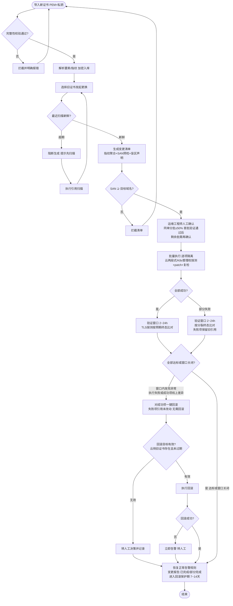

# SSL 证书统一托管与更换 — PRD Spec

> PRD Spec: defines WHAT the feature is and why it exists.
> 上游输入：`docs/proposals/ssl-cert-management/proposal.md`（对抗评估 936/1000 通过）。
> 本 PRD 已吸收评估遗留的 PRD 层问题（见 Other Notes → 评估遗留项消解）。

<!-- Override: API handbook enabled by signal "新 API/接口"（证书管理全新接口面） -->
<!-- Override: Security Review enabled by signal "加密/权限/私钥"（私钥托管、EIAM 权限） -->

## Background

### Why (Reason)

EV/OV 付费证书无法 ACME 自动签发，签发环节永远在平台外部；每轮换证（年均数十轮 × 每轮十几处引用点 = 年均数百次高危手工变更）需要在多云 DCDN/CDN、WAF、ALB/CLB/NLB、多云 K8s 自建网关（ALBConfig 等 CRD 引用云托管证书 ID）上逐处手工更换。无统一台账，无法回答"这张证书被哪些资源引用"、"各子域名证书何时到期"，漏换即线上 HTTPS 事故。

### What (Target)

在 e-cam 平台（后端 e-cam-service / 前端 e-cam-web）新增证书管理功能域，围绕"人工购买 → 平台托管 → 自动发现引用 → 一键批量更换 → 验证生效"闭环，提供：证书托管台账、完整性检查、引用关系发现、到期监控与告警、TLS 主动探测、指纹聚合一键批量更换（含回滚与变更报告）、可插拔执行通道。

### Who (Users)

| 角色 | 职责 | 主要操作 |
|------|------|---------|
| 运维工程师 | 日常操作者 | 导入证书、查看台账/引用/看板、发起并确认批量更换、处理告警 |
| 运维主管/审计 | 管理与审计 | 审阅变更报告与操作日志、配置告警规则与接收人、维护探测豁免清单 |
| 只读查看者 | 业务方 | 仅查看到期看板与子域名证书健康度（证书台账/变更管理页面与路由不可见） |

## Goals

| Goal | Metric | Notes |
|------|--------|-------|
| 证书资产台账化 | 存量初始导入后指纹登记覆盖率 ≥ 90%（分母 = 引用扫描发现的在用证书去重集合 + 人工补充登记集合，分母来源独立于导入通道）；完整托管率与仅指纹登记率分别可见 | 覆盖率拆两个口径，防"覆盖率掩盖可更换率" |
| 消除批量换证手工操作 | 阿里云+腾讯云 CDN/DCDN/WAF/LB + 多云 K8s CRD 批量执行成功率 ≥ 95% | 分母仅含首期已交付部署器的目标；华为云/AWS/Azure 引用点单列为不可执行项不计入分母；单点失败不阻塞其他目标 |
| 到期风险前置 | 30/14/7 天分级告警按已配置渠道触达；未豁免端点 TLS 探测覆盖 | 受告警渠道门控（渠道确认为 PRD 前置依赖） |
| 变更安全可控 | 回滚成功率 100%（回滚对象 = 本次变更执行成功的资源，且限通过目标有效性校验的项）；变更报告与审计 100% 留存 | 回滚口径见 Flow 与 In Scope 回滚语义 |

## Scope

### In Scope

- [ ] 证书托管台账：导入（证书+私钥）、列表/详情/删除（存在活跃引用或处于回滚保护期内拦截删除）、要素解析（SAN/签发者/有效期/指纹）、私钥加密存储
- [ ] 存量初始导入：批量导入 + 私钥定向回收；无法回收私钥的存量证书支持"仅指纹登记"；台账指纹覆盖率度量（登记覆盖率 / 可更换托管覆盖率分列）
- [ ] 完整性检查：证书/私钥匹配、证书链完整性、SAN 解析（结构合法）、有效期校验；导入拦截 + 定时巡检。SAN 域名覆盖校验不作为导入门槛（新导入证书尚无引用，基准无从构造），移至变更清单生成时预检（基准 = 变更清单目标资源所服务的域名集合）；导入时可选填写"预期域名"，系统仅作提示性比对、不拦截
- [ ] 引用关系发现（只读，全云）：阿里云/腾讯云/华为云/AWS/Azure 的 CDN/DCDN/WAF/LB 证书引用扫描；多云 K8s 网关 CRD 证书引用扫描（首期扫描范围固定枚举：ALBConfig、Ingress、Gateway API 的 Gateway/HTTPRoute；其余自定义资源按判定规则纳入——凡 spec 中含云托管证书 ID/名称引用字段的网关类资源，经登记后纳入扫描范围，未登记的 CRD 属扫描盲区并在视图中显式声明）；按证书指纹关联形成"证书 → 资源"视图与反向查询；记录扫描时间与资源覆盖率元数据；视图与变更清单显式声明覆盖边界（首期不含 VM Nginx 配置级引用）
- [ ] 到期监控与告警：按子域名到期看板、30/14/7 天分级告警、webhook + 邮件渠道、全局统一接收人配置
- [ ] TLS 主动探测：对托管子域名端点定期握手探测线上生效证书，与台账比对，差异告警；内网不可达子域名支持"探测豁免"单列清单（不参与常规差异告警）
- [ ] 一键批量更换：新证书导入后按证书指纹（非域名）匹配同一旧证书全部引用点生成变更清单（通配符/多 SAN 证书按证书粒度建模）；清单强制绑定最近扫描，扫描超出新鲜度阈值（量级 24 小时，具体可配）阻断生成；新证书 SAN ⊇ 变更清单目标域名预检，不满足则拦截；华为云/AWS/Azure 引用点在清单中单列展示为"不可执行项（首期无部署器）"，不计入批量执行成功率分母，清单显式提示二期处理或手工更换；人工确认 → 批量执行 → 逐项进度 → 失败回滚 → 变更后验证 → 变更报告；分批为同一变更单内分批：单批不超过清单总量一半，首批执行且验证通过后方可继续执行剩余批，剩余批同样需人工确认后执行，全部批次完成后生成整体变更报告
- [ ] 回滚语义：回滚作用于本次变更中**执行成功**的资源（将其引用恢复为旧证书 ID）；执行失败项的引用从未被改动，不参与回滚，仅在变更报告中标记；"验证窗口内发现失败项"指执行阶段失败或验证探测发现线上异常的资源。回滚入口在执行中（出现失败项后）、验证中、部分完成状态均可用；范围限本次变更涉及资源；回滚前校验回滚目标有效性（云侧证书库中旧证书仍存在且未过期；已删除/已过期则不自动回滚，转人工决策并记录）；回滚自身失败立即告警并转人工
- [ ] 变更后验证窗口：时长量级小时级（2~24 小时，具体可配）；窗口内 TLS 探测按变更清单预期终态（含部分成功的分裂状态）比对，差异以"变更关联告警"呈现，窗口关闭或全部达标后恢复常规告警规则
- [ ] 首期部署器：阿里云、腾讯云的 CDN/DCDN/WAF/ALB(LB)（含"上传到云证书库 + 绑定资源"两段式；第二段失败时依据映射表补偿清理未绑定的云侧孤儿证书）；多云 K8s 集群网关 CRD 证书引用更新（仅 patch 证书引用字段、保留原值记录；更新前探测资源管理权（能力层判定：基于资源元数据的标注/注解与清单来源信息，判定资源是否被 GitOps/控制器管理），判定为受管理的目标标记"不可自动变更"并单列清单，同时展示管理方线索（如来源仓库名）并引导用户走其自身管理链路（GitOps 仓库 / 控制器发布流程）完成更换，首期不提供越权自动变更；变更后复检防 reconcile 回写）
- [ ] 云证书映射表：维护"平台托管证书 ↔ 各云证书库证书 ID"映射，作为两段式去重、回滚定位与孤儿清理的基础数据
- [ ] 执行通道抽象：云 API 通道、K8s API 通道实现；堡垒机通道、优维 Agent 通道接口预留（可插拔性以模拟通道端到端演示零上层改动验证）
- [ ] 权限与审计：接入 EIAM（三角色权限粒度）；变更操作全量审计日志
- [ ] 前端（e-cam-web）：证书管理页面（证书台账、引用关系、到期看板、变更向导与报告）

### Out of Scope

- 华为云、AWS、Azure 的证书更换部署器（二期；首期这三家只做引用发现与到期监控，存在"看得到却换不了"运营窗口，靠告警兜底，二期排期与引用点增长绑定）
- VM Nginx 的配置级引用发现与证书推送更换（依赖堡垒机/优维 Agent 通道，二期；首期 Nginx 仅 TLS 探测监控）
- ACME 自动签发、证书供应商 API 自动续费下单（与 EV/OV 采购模式不符）
- 更换前的多人审批流（首期为单人确认；误操作面靠完整性前置校验 + 指纹精确匹配 + 扫描新鲜度 + 分批灰度（单批不超过总量一半）+ 回滚兜底 + EIAM 权限收敛 + 全量审计覆盖）
- K8s Secret 直管证书（当前场景为 CRD 引用云托管证书）

## Flow Description

### Business Flow Description

**主流程：换证**

1. 运维工程师导入新购证书（PEM + 私钥）→ 系统校验（私钥匹配/证书链/有效期/SAN 结构解析；可选填"预期域名"仅作提示性比对不拦截），不合格 100% 拦截并明确报错
2. 工程师选择旧证书发起更换 → 系统按证书指纹匹配该旧证书全部引用点；校验最近一次引用扫描新鲜度，超期阻断并提示先���描
3. 系统生成变更清单：逐项列出资源、计划动作、原证书 ID；执行 SAN 预检（新证书 SAN ⊇ 全部目标资源服务域名），不满足拦截；清单含覆盖边界声明（不含 VM Nginx 配置级引用）
4. 工程师人工确认（支持同单分批：单批不超过清单总量一半）→ 批量执行（云资源两段式：上传云证书库→绑定；K8s：管理权探测→patch→复检；逐项隔离，单点失败不阻塞）；首批执行且验证通过后可继续执行剩余批，剩余批同样需人工确认
5. 变更后进入验证窗口（2~24h）：TLS 探测按预期终态比对，差异以"变更关联告警"呈现；全部达标或窗口关闭后恢复正常告警
6. 生成变更报告（清单、逐项结果、回滚状态、验证结果、孤儿证书补偿清理结果）
7. 进入回滚保护期（7~14 天）：期间旧证书禁止删除
8. 执行出现失败项、或验证窗口内发现成功项线上异常：可对**成功项**一键回滚（将其引用恢复为旧证书 ID；执行失败项的引用从未被改动，无需回滚，仅在报告中标记）；回滚前校验云侧旧证书仍存在且未过期，无效则转人工决策并记录。回滚入口在执行中（出现失败项后）、验证中、部分完成状态均可用

**次流程：存量初始导入（bootstrap）**

批量导入存量证书（逐文件返回导入结果，部分文件失败不阻塞其他文件，失败文件可单独重试）；私钥定向回收（从原持有方收回私钥文件）；无法回收者登记为"仅指纹登记"（可监控、可展示引用，不可自动更换），后续补传私钥通过匹配校验后升级为完整托管；统计登记覆盖率与可更换托管覆盖率。

**并发与边界规则**

- 变更单互斥：同一旧证书同一时刻仅允许一张活跃（待确认/执行中/验证中）变更单绑定；对同一旧证书重复发起时阻断，并指向在途变更单
- 扫描与执行并发：变更单执行期间其清单快照固定不变；引用关系视图同时展示"扫描快照时间"与"变更执行中"状态，二者不混淆
- 云 API 限流：批量执行自动限流退避重试，进度页逐项展示"限流重试中"状态；重试耗尽方计为执行失败
- 验证窗口关闭仍未达标：该项转为常规 TLS 差异告警持续跟踪，并记入变更报告"未达标清单"

**次流程：定时巡检**

天级巡检：托管证书完整性复检、到期分级计算（30/14/7 天）、TLS 探测（未豁免端点）、引用扫描（全云 + K8s CRD，记录覆盖率元数据）。

**状态机（变更单）**：`草稿 → 待确认 → 执行中 → 验证中 → 已完成 / 部分完成 → 已回滚 / 回滚失败(转人工) → 关闭`。回滚入口在执行中（出现失败项后）、验证中、部分完成状态均可用；回滚保护期为已完成/部分完成状态的附属属性。

### Business Flow Diagram

### Data Flow Description

| Data Flow ID | Source System | Target System | Data Content | Transport | Frequency | Format | Notes |
|-----------|--------|----------|----------|----------|------|------|------|
| DF001 | 多云 CDN/DCDN/WAF/LB API | e-cam-service | 资源证书引用（证书名/ID、资源标识） | 云厂商 API（只读） | 天级扫描 | 云 API 响应 | 复用已有云账号凭证与 SDK 适配层 |
| DF002 | 多云 K8s 集群 | e-cam-service | 网关 CRD（ALBConfig 等）证书引用字段 | K8s API（读） | 天级扫描 | CRD YAML/JSON | 需各集群接入凭证（前置依赖） |
| DF003 | e-cam-service | 多云证书库 | 上传新证书（两段式第一段） | 云厂商 API（写） | 换证时 | PEM | 产生映射表记录 |
| DF004 | e-cam-service | 多云 CDN/WAF/LB | 绑定新证书 ID（两段式第二段） | 云厂商 API（写） | 换证时 | 云 API 请求 | 失败触发补偿清理 |
| DF005 | e-cam-service | 多云 K8s 集群 | patch CRD 证书引用字段 | K8s API（写） | 换证时 | JSON Patch | 前置管理权探测，事后复检 |
| DF006 | e-cam-service | 目标子域名端点 | TLS 握手读取线上生效证书 | TLS | 天级探测 | X.509 | 豁免端点除外 |
| DF007 | e-cam-service | webhook/邮件 | 到期/差异/变更关联/回滚失败告警 | webhook + SMTP | 事件触发 | JSON/邮件 | 全局统一接收人 |

## Functional Specs

> UI 功能规格详见 [prd-ui-functions.md](./prd-ui-functions.md)。

### Related Changes

| # | Project | Module | Change Point | Updated Logic |
|------|----------|----------|------------|----------------|
| 1 | e-cam-service | 导航/权限资源 | 新增证书管理功能域的 EIAM 权限资源同步 | 启动时同步新接口权限资源（沿用现有机制） |
| 2 | e-cam-service | 定时任务 | 新增巡检/扫描/探测定时任务注册 | 挂入现有任务框架 |
| 3 | e-cam-web | 路由/菜单 | 新增"证书管理"一级菜单与四类页面 | 沿用现有导航与权限控制 |
| 4 | e-cam-service | 告警通道 | 新增 webhook + 邮件发送能力 | 通道配置化管理；渠道确认为 PRD 前置依赖 |

## Other Notes

### Performance Requirements

- 响应时间：台账/看板列表查询秒级；变更清单生成 ≤ 30 秒（千级引用点）
- 并发：批量执行逐项隔离并发受控（云 API 限流退避）；单变更清单目标数上限可配
- 容量量级：证书百张、引用点数千、单轮扫描分钟到小时级
- 兼容性：前端适配现有 e-cam-web 支持的浏览器范围

### Data Requirements

- 数据跟踪：变更单全生命周期状态、逐项执行结果、回滚记录、审计日志全量留存
- 数据初始化：存量证书批量导入（bootstrap 场景）；历史漏换/临期事件回溯量化补录
- 数据迁移：无存量数据迁移（新功能域）
- 云证书映射表：平台证书 ↔ 各云证书 ID 双向可查，作为去重/回滚定位/孤儿清理基础

### Monitoring Requirements

- 平台自身：证书域服务健康、扫描/探测任务成功率监控
- 业务告警四类：到期分级（30/14/7 天）、TLS 差异、变更关联（验证窗口内）、回滚失败
- 告警门控：所有依赖告警渠道的成功标准，在渠道确认完成前不进入验收

### Security Requirements

- 传输加密：全程 HTTPS；私钥上传通道加密
- 存储加密：私钥加密存储，加密密钥独立于业务数据管理（选型留 tech-design）
- 私钥使用约束：仅在完整性校验、上传云证书库等必要环节于内存中解密，用后释放；不落盘、不写日志与变更报告；任何接口与前端不得返回明文私钥（"渗透式自查"口径：API/日志/报告/前端请求与本地存储均无明文私钥，检查结果留档）
- 备份恢复：平台数据丢失不得导致 EV/OV 私钥不可恢复（备份周期天级、恢复小时级）
- 权限：EIAM 三角色（运维工程师=读写、运维主管/审计=审计+配置、只读查看者=看板只读）；操作全量审计

### 评估遗留项消解（proposal eval iteration-2 → PRD 层）

| # | 遗留项 | PRD 消解方式 |
|---|--------|-------------|
| 1 | SC 分母自指 | 引用扫描覆盖率以资产同步的独立盘点资源总数为分母（分母来源独立于扫描通道） |
| 2 | K8s 凭证门控 | K8s 凭证就绪列为与告警渠道同级的验收门控：未就绪则 K8s 相关 SC 不进验收 |
| 3 | 覆盖率口径 | 拆分"登记覆盖率"与"可更换托管覆盖率"两个指标（见 Goals） |
| 4 | SAN 基准 | SAN 覆盖基准 = 引用资源所服务域名集合；变更清单生成时预检 SAN ⊇ 目标域名 |
| 9 | SAN 缩水场景 | 清单生成预检拦截（Flow 步骤 3），防"静默丢域名"形态漏换 |
| 8 | 告警门控粒度 | 门控限定到"告警触达"而非看板展示；门控范围统一为所有依赖渠道的 SC |
| 11 | 单人确认论证 | Out of Scope 审批流条目已载明七层覆盖论证 |
| 12 | 时间窗口径 | 验证窗口 2~24h、回滚保护期 7~14 天（具体值可配，tech-design 定稿） |
| 10 | 指纹登记占比 | bootstrap 场景预估并持续展示"仅指纹登记"占比；占比异常偏高时人工评估回收可行性 |
| 5/6/7 | 证据量化/工期驱动/风险表补行 | 属提案层遗留，其中风险表补行在 tech-design 阶段随实现细化；工期驱动因素（PoC 结果/前端范围）在 breakdown-tasks 时定 |

---

## Quality Checklist

- [x] 需求标题准确
- [x] 背景含原因/目标/用户三要素
- [x] 目标已量化
- [x] 流程描述完整（主流程 + bootstrap + 巡检 + 状态机）
- [x] 业务流程图存在（Mermaid）
- [x] 已引用 prd-ui-functions.md
- [x] 相关变更已分析（4 项）
- [x] 非功能需求齐备（性能/数据/监控/安全）
- [x] 表格填写完整
- [x] 无模糊措辞
- [x] 可验收、可执行
